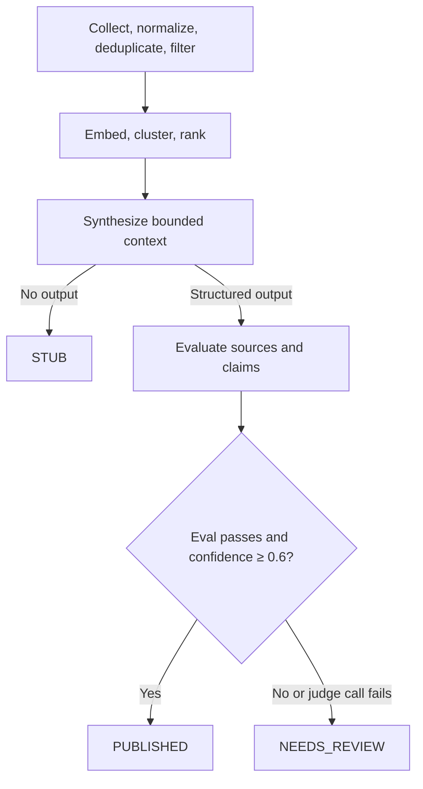

# Argus Overwatch

Argus Overwatch is a file-first news intelligence pipeline built to answer a simple question: how do you use LLMs in a production workflow without quietly trusting them too much?

It collects news from multiple sources, normalizes and deduplicates articles, clusters related coverage, ranks stories, synthesizes a report, and evaluates that output before it can be treated as publishable.

The interesting part of the project is not the model call. It is the boundary around it.

## Architecture



Clustering and ranking use application code and local embeddings, not generative LLM decisions. Application code owns the final publication gate, which uses a model judge's result and the synthesizer's self-reported confidence.

A synthesized story only reaches `PUBLISHED` when both of these are true:

- the model reports confidence at or above the code-defined threshold of 0.6;
- an evaluation step passes the story against the project's quality bar.

Judge transport or JSON parsing failures route the story to `NEEDS_REVIEW`. `PUBLISHED` is a local report classification; this pipeline does not automatically post stories to an external service.

See [`docs/ARCHITECTURE.md`](docs/ARCHITECTURE.md) for the full design.

## What changed after real runs

The design has been repeatedly revised around failures observed against live data rather than hypothetical edge cases.

A few examples:

- A 42-article single-source cluster nearly outranked a genuinely cross-verified story because raw article count dominated the ranking formula. Article count now uses diminishing returns (`log1p`) so source diversity remains the stronger signal.
- The same oversized cluster repeatedly timed out synthesis. Context is now capped to the most source-diverse and recent articles before the model call.
- An intended "strong" local model turned out not to support chat and was too large for the available machine anyway. Rather than preserve a fake two-tier abstraction, local routing was collapsed to one real model.
- A resumed run originally re-fetched and re-clustered work it had already completed. The pipeline now checkpoints deterministic stages and persists synthesized stories one at a time so interrupted runs continue from completed work.
- A later live run exposed a mismatch where synthesis honored the configured timeout but the evaluation judge silently used its own default. The timeout is now threaded through both paths and covered by regression tests.

The rationale and consequences for the larger changes are documented in [`docs/adr/`](docs/adr/).

## Why file-first

The product is a daily set of reviewable reports, not a web application. Files make runs easy to inspect, reproduce, diff, and publish without introducing infrastructure that does not yet solve a real problem.

That decision is deliberate and documented in ADR 0001. A web UI stays deferred until there is a concrete workflow that files no longer handle well enough.

## Reliability and resumability

Runs checkpoint at three levels:

```text
data/raw/<date>.jsonl        # collection / normalization / filtering complete
data/processed/<date>.jsonl  # clustering / ranking complete
data/stories/<date>.jsonl    # synthesized stories, persisted individually
```

If synthesis is interrupted on story 12 of 15, the next run resumes from completed work rather than paying the full cost again. Cluster IDs hash sorted article URL hashes; changed cluster membership invalidates a saved story. Changes to article text, prompts, model settings, or evaluation policy do not change that ID: use `--fresh` when those changes should trigger recomputation.

## Quality gate

Generated stories are evaluated for:

- source citations;
- clear separation of sourced fact from synthesis;
- unsupported claims;
- minimum model confidence.

Application code owns the final state transition. That boundary makes the decision inspectable; it does not make model judgments independent or infallible. The citation check establishes that source URLs exist, not that every claim has a verified inline citation. The judge sees selected feed titles and summaries, not the full source articles.

## Stack

Python 3.11+, `httpx`, `feedparser`, `model2vec`, scikit-learn, APScheduler, Ollama-compatible local inference, optional Anthropic synthesis, pytest, Ruff, and GitHub Actions.

## Run locally

```bash
python3 -m venv apps/pipeline/.venv
source apps/pipeline/.venv/bin/activate
python -m pip install -e 'apps/pipeline[dev]'
cp .env.example .env
```

Run these commands from the repository root. Start Ollama, pull the model you intend to use, then edit `.env`. The Python settings reader uses environment variables; it does **not** load `.env` automatically. In bash or zsh, export the file before starting Python:

```bash
set -a
source .env
set +a
export ARGUS_SYNTHESIS_BACKEND=local
python apps/pipeline/scripts/run_daily.py --date "$(date -u +%F)"
```

Only source a local configuration file you control. `local` uses Ollama for synthesis and judging. Set `ARGUS_SYNTHESIS_BACKEND=stub` to produce headline/source reports without LLM calls; feed collection and the first embedding-model download still need network access. Cloud synthesis requires the optional `llm` extra and an Anthropic key, and still uses the local Ollama judge.

For the exact checked-in dependency versions, use `uv sync --frozen --extra dev` from `apps/pipeline/` instead of the pip install above.

## Inspect without running a model

```bash
cd apps/pipeline
.venv/bin/ruff check .
.venv/bin/pytest -q
```

The tests cover state transitions, ranking, bounded context, configuration, and checkpoint reuse with controlled inputs. They do not establish live model quality. Start with [`tests/test_synthesize_pipeline.py`](apps/pipeline/tests/test_synthesize_pipeline.py) and [`tests/test_resume.py`](apps/pipeline/tests/test_resume.py).

See the [real September 10 report](examples/real-run/2026-09-10/apple-unveils-first-foldable-iphone-in-major-product-update.md), its [saved evaluation and provenance](examples/real-run/provenance.json), and a [review of what the judge missed](examples/real-run/REVIEW.md). The report and original records are preserved without rewriting the prose or verdict.

## Current status

The ADRs record local v4 runs against real news data, including synthesis, review gating, and checkpoint reuse. The snapshot includes one saved September 10 report from `local:qwen3:14b`, with its recorded `published` status, 0.85 confidence, source context, and evaluation. A passing gate is not a claim that every attribution is correct; the accompanying review identifies concrete limitations.

Known limits:

- Local synthesis and evaluation use the same model; this is not independent verification, and model confidence is not a calibrated probability.
- Structured response schemas are requested from Ollama, but strict response-type validation remains incomplete in application code.
- The real clustering benchmark needs historical processed checkpoints that are not distributed here.
- The Anthropic path has not been verified against a funded account. This snapshot has no runnable container package; historical container plans in the ADRs are not setup instructions.
- Unfinished MCP integration and archived implementations are omitted from the public export.

## Docs

- [`docs/ARCHITECTURE.md`](docs/ARCHITECTURE.md) — system shape, contracts, state machine, and quality bar
- [`docs/adr/0001-single-container-no-web-app-for-v1.md`](docs/adr/0001-single-container-no-web-app-for-v1.md) — why the project intentionally stays file-first
- [`docs/adr/0002-v4-bounded-agent-synthesis.md`](docs/adr/0002-v4-bounded-agent-synthesis.md) — why synthesis became a bounded state machine, including failures found in live runs
- [`docs/ROADMAP.md`](docs/ROADMAP.md) — what is verified, what remains, and what is intentionally deferred
