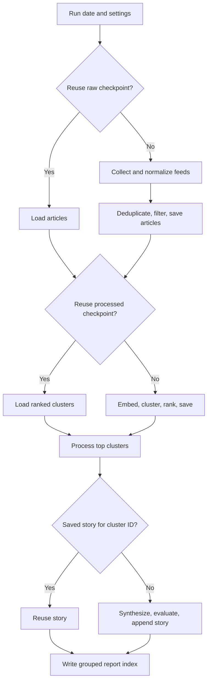
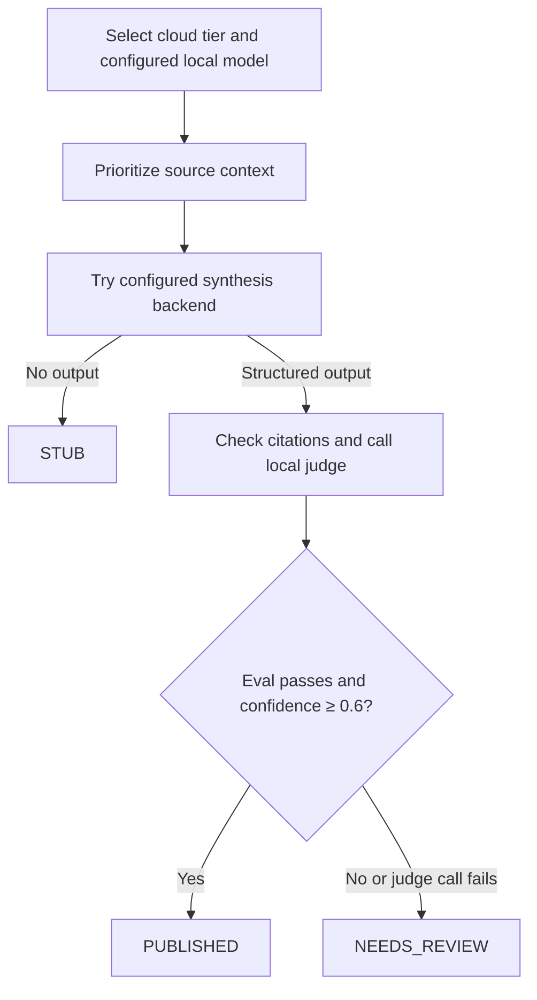

# Daily run flow

`scripts/run_daily.py` accepts `--date`, `--verbose`, and `--fresh`, loads
exported environment settings, and calls `argus.pipeline.run()`.

## Checkpoint reuse

`--fresh` bypasses reuse. Cluster IDs reflect article URL membership;
they do not detect changes to article text or inference configuration.

## Publication gate

`auto` tries cloud synthesis when a key is set, then local synthesis, then
stub output. `local` uses one model at every rank. The judge is local even
when synthesis used Anthropic. Reports are written to disk; `PUBLISHED`
does not send a story to an external publishing service.

See [architecture](ARCHITECTURE.md) for the gate's validation and trust limits.
